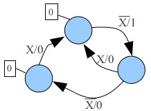
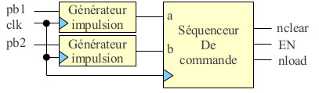
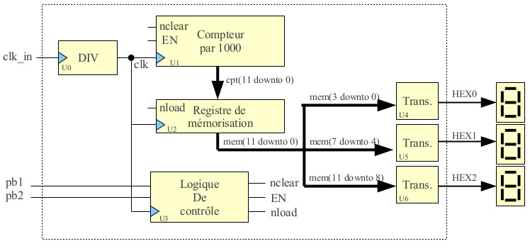

#Stopwatch with pause, reset and memory possibilites

The aim is to develop in VHDL a stopwatch on an Altera DE2-70.

####Basic information

The stopwatch is updated each tenth of a second while the original clock frequency is 50MHz, therefore the clock has to be divided to reach 10Hz (division by 5.000.000). The clock_rate module is responsible for this division.

A register is used to store a lap time and transcoders are the components responsible for the transformation of a binary code to its value printed on one 7-segment display.

The stopwatch will be displayed on 3 7-segment displays which allow us to count up to 999. To make it easier, each display has its own counter: one for units, tens and hundreads. The activating input is EN, active high while reset input nclear is active low. The unit counter is synchronised on the 10Hz clock.
The register is a 12-bits synchronous register set when nload ias at low state.

The command sequencer has as input two buttons (a and b) and will output three signals: EN, nclear and nload. Signals are generated as following:

A unique impulse generator is a module used to be sure a pressed (and unreleased) button will "count" as only one click. For doing this, the following state machine is used:

The structure of the controller part:

The whole stopwatch system:

####Author:
Quentin SCHULZ (quentin.schulz@utbm.fr)

#####Changelog

**v0.1 - 2014-02-23**
Initial release. 
